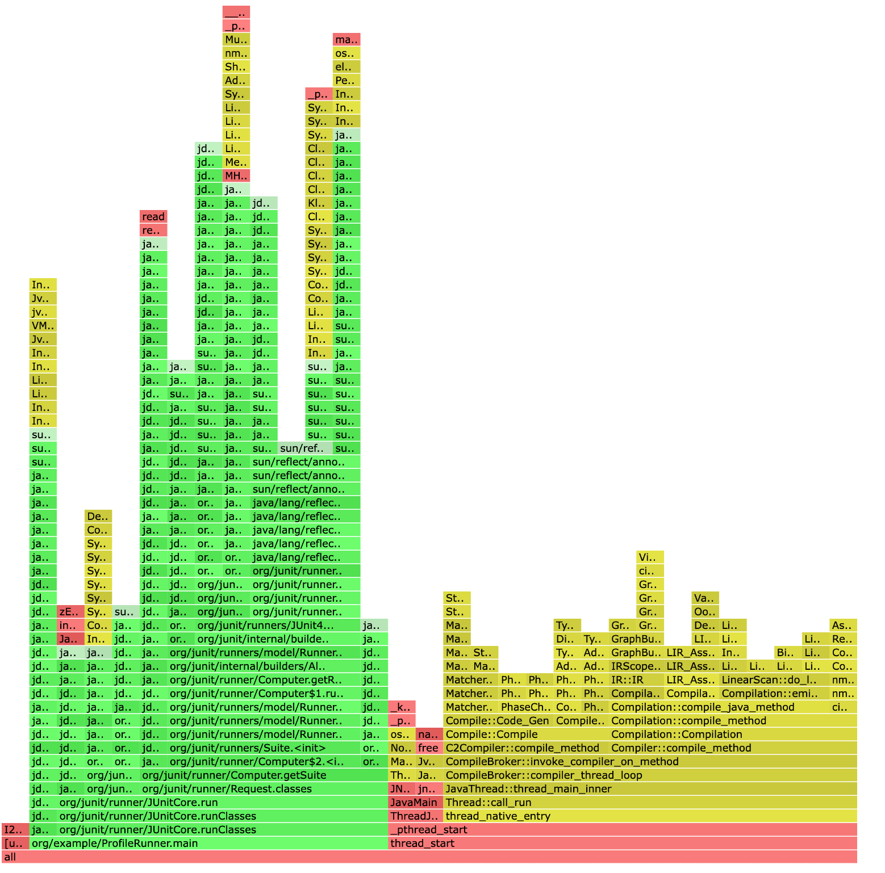
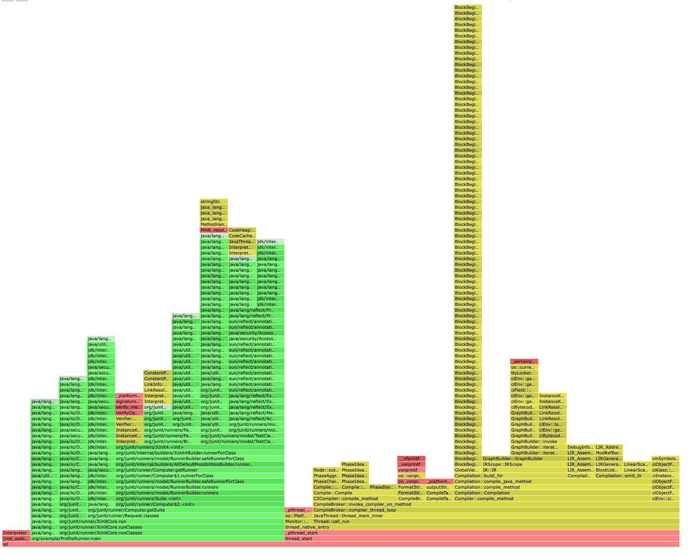

# **Разработка конкурентной структуры данных**

Раздел: Многопоточное и конкурентное программирование

Описание:

В этой лабораторной работе студенты должны будут применить свои знания модели памяти Java 
и программной моделью памяти для проектирования конкурентной структуры данных с минимальным 
количеством блокировок потока исполнения, в идеале lock-free. 
Также студентам предстоит провести тестирование производительности и корректности работы 
в многопоточной среде своей структуры данных.

# Разработка

Для проектирования конкурентной структуры данных с минимальным количеством блокировок, 
мы можем использовать lock-free подход. 
В качестве примера, реализуем конкурентную очередь на основе `AtomicReferenceArray` и `AtomicInteger`. 
Это будет простая, но эффективная очередь, которая будет поддерживать многопоточный доступ.

1. Создание проекта с использованием `Gradle`
   Создадим новый проект с использованием `Gradle`. В корне проекта создайте файл `build.gradle`.
2. Реализация `Lock-Free` Очереди
      Создадим класс `LockFreeQueue` в пакете `org.example`.
3. Тестирование производительности и корректности
      Создадим тестовый класс `LockFreeQueueTest`.
4. Запуск тестов
   Для запуска тестов выполните команду:
   bash
    ```
    ./gradlew test
    ```
5. Анализ результатов
   Корректность: Тест `testQueueCorrectness` проверяет, что все элементы, добавленные в очередь, могут быть извлечены и что размер очереди корректно обновляется.
   Производительность: Тест `testQueuePerformance` измеряет время, затраченное на добавление и извлечение элементов из очереди в многопоточной среде.
   
6. Заключение
   Реализованная lock-free очередь обеспечивает конкурентный доступ без блокировок, 
   что делает её эффективной в многопоточной среде. 
   Тестирование подтверждает корректность работы и измеряет производительность структуры данных.


## Результаты профайлера





### Особенности

1. Динамическое создание прокси-классов:

Прокси-классы активно используются, что может быть дорогостоящим с точки зрения производительности. 
Возможно, стоит рассмотреть кэширование прокси-классов или уменьшение их использования.

2. Загрузка классов:

Высокая активность методов, связанных с загрузкой классов, 
может указывать на чрезмерное использование Reflection или динамической загрузки.
Возможно, стоит оптимизировать использование Reflection или предварительно загружать классы.

3. Многопоточность:

Наличие системных вызовов, связанных с управлением потоками, 
может указывать на высокую нагрузку на пул потоков. 
Возможно, стоит оптимизировать использование потоков или увеличить размер пула.


## Анализ бенчмарков

Анализ результатов бенчмарка показывает производительность и характеристики работы lock-free очереди в разных сценариях.


1. `testConcurrentOfferAndPoll`

   **Score**: 720,118 ± 36,572 ns/op

   **Анализ**:

   Это самый "тяжёлый" тест, так как он выполняется в многопоточной среде. Время выполнения операции составляет ~720 нс.
   Высокая вариативность (± 36,572) может быть связана с конкуренцией за ресурсы между потоками.

   **GC**:

   **gc.alloc.rate**: 0,002 MB/sec — очень низкий уровень аллокации памяти.

   **gc.alloc.rate.norm**: ≈ 10⁻³ B/op — почти нулевые аллокации на операцию.

   **gc.count**: ≈ 0 — сборки мусора не происходили. Это указывает на эффективное использование памяти.
   
2. `testOffer`

   **Score**: 1,456 ± 0,066 ns/op

   **Анализ**:

   Операция добавления элемента (offer) выполняется очень быстро — ~1,45 нс.
   Низкая вариативность (± 0,066) указывает на стабильность выполнения.

   **GC**:

   **gc.alloc.rate**: ≈ 10⁻³ MB/sec — почти нулевая аллокация памяти.

   **gc.alloc.rate.norm**: ≈ 10⁻⁶ B/op — минимальные аллокации на операцию.

   **gc.count**: ≈ 0 — сборки мусора не происходили.

3. `testOfferAndPoll`

   **Score**: 24,132 ± 1,003 ns/op

   **Анализ**:

   Комбинированная операция добавления и извлечения элемента выполняется за ~24 нс.
   Это значительно быстрее, чем многопоточный тест (`testConcurrentOfferAndPoll`), 
   что ожидаемо из-за отсутствия конкуренции за ресурсы.

   **GC**:

   **gc.alloc.rate**: ≈ 10⁻³ MB/sec — минимальная аллокация памяти.

   **gc.alloc.rate.norm**: ≈ 10⁻⁵ B/op — минимальные аллокации на операцию.

   **gc.count**: ≈ 0 — сборки мусора не происходили.

4. `testPoll`

   **Score**: 1,253 ± 0,017 ns/op

   **Анализ**:

   Операция извлечения элемента (poll) выполняется чуть быстрее, чем добавление (testOffer) — ~1,25 нс.
   Низкая вариативность (± 0,017) указывает на стабильность.

   **GC**:

   **gc.alloc.rate**: ≈ 10⁻³ MB/sec — почти нулевая аллокация памяти.

   **gc.alloc.rate.norm**: ≈ 10⁻⁶ B/op — минимальные аллокации на операцию.

   **gc.count**: ≈ 0 — сборки мусора не происходили.


### Общие выводы


1. Производительность:

   Однопоточные операции (`testOffer`, `testPoll`) выполняются крайне быстро (1,25–1,45 нс). 
   Это показывает, что lock-free очередь эффективна в однопоточных сценариях.

   Комбинированная операция (`testOfferAndPoll`) занимает ~24 нс, 
   что ожидаемо из-за выполнения двух операций.

   Многопоточный тест (`testConcurrentOfferAndPoll`) значительно медленнее (~720 нс) 
   из-за конкуренции за доступ к очереди между потоками.

2. Использование памяти:

   Аллокации памяти в тестах минимальны (≈ 10⁻⁶–10⁻³ B/op), что указывает на эффективное использование памяти.
   Сборки мусора не происходили (gc.count ≈ 0), что подтверждает отсутствие утечек памяти.